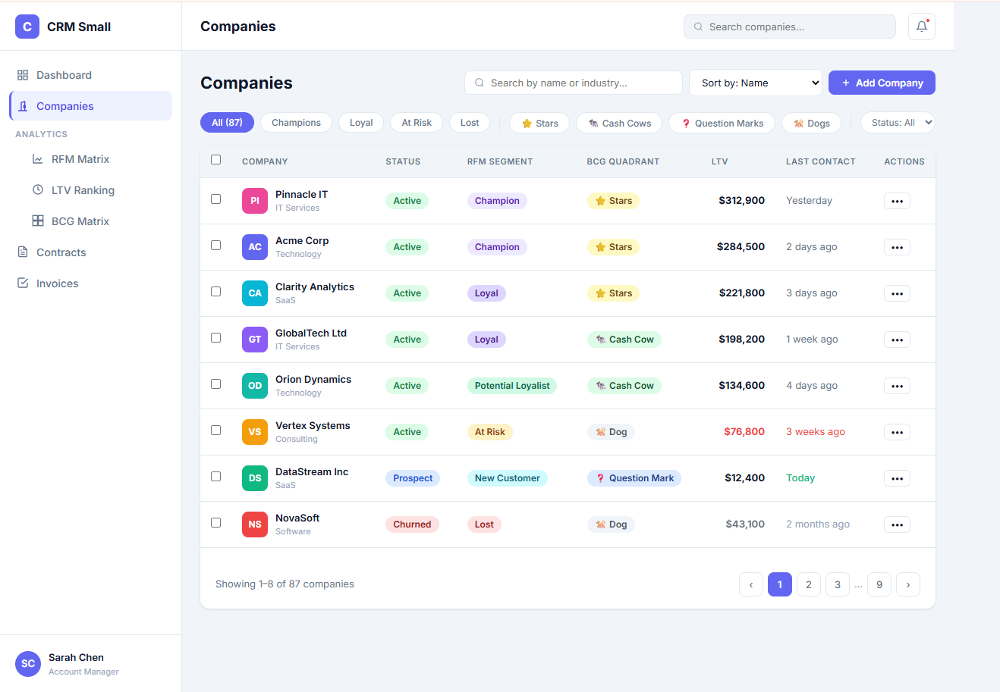
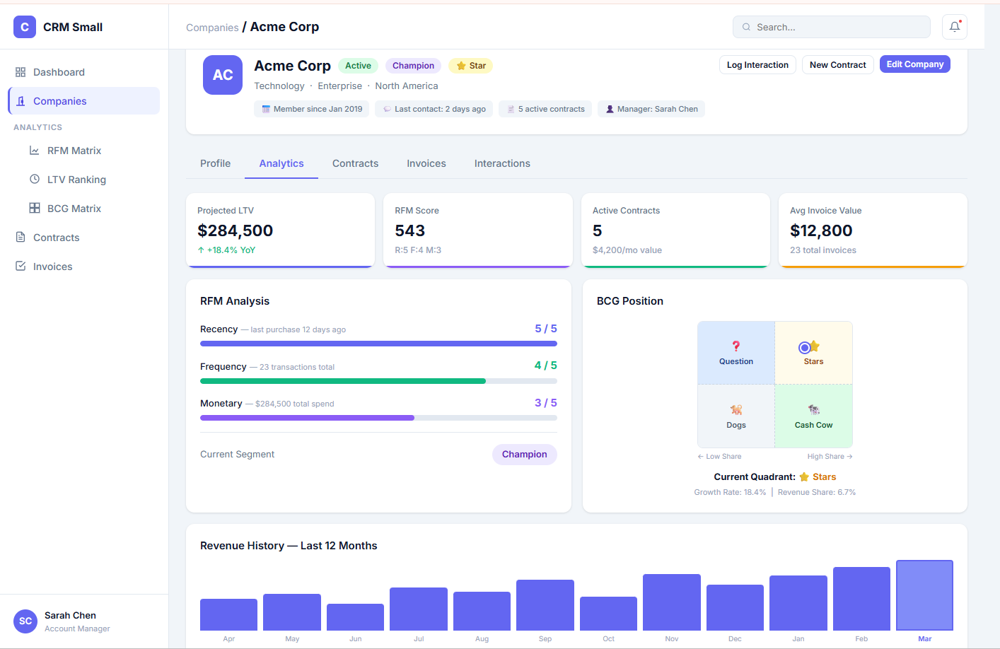
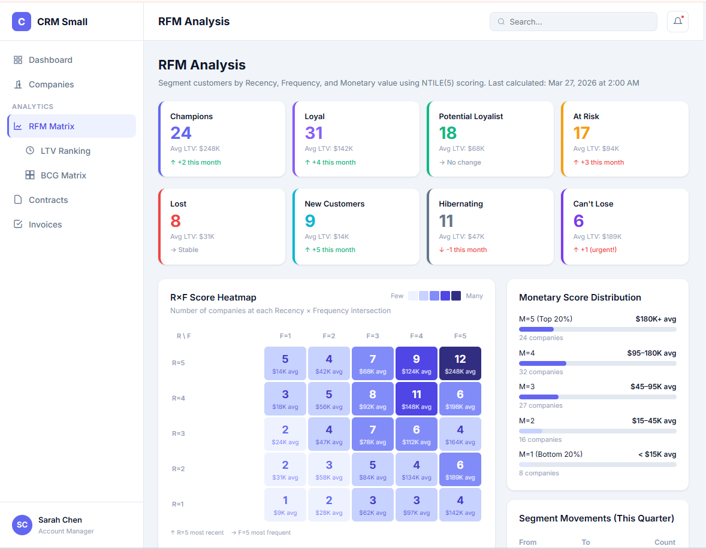

# crm-small

CRM for IT services — LTV and RFM analytics.

## Functionalities

### Companies


The company list view provides a filterable, sortable table of all clients. Each row shows the company name, status (Active, Churned, Lost), RFM segment (Champion, Loyal, At Risk, etc.), BCG quadrant (Star, Cash Cow, Question Mark, Dog), last invoice amount, last activity date, and quick actions. Filter buttons at the top allow narrowing by status or BCG quadrant at a glance.

### Company BCG, LTV


The company detail analytics tab consolidates key financial and behavioral metrics in one view. Summary cards show total LTV, number of active contracts, and the latest invoice amount. The RFM Analysis panel displays individual Recency, Frequency, and Monetary scores (each out of 5) alongside the derived segment (e.g. Champion). The BCG Position panel plots the company on the Growth-Share matrix and highlights the current quadrant. A Revenue History bar chart covering the last 12 months rounds out the view.

### RFM Analysis


The portfolio-level RFM Analysis page segments all companies using NTILE(5) scoring calculated nightly. Segment summary cards (Champions, Loyal, New Customers, At Risk, etc.) show client counts and total revenue per segment. The R×F Score Heatmap visualises the distribution of clients across all Recency/Frequency combinations. A Monetary Score Distribution bar chart breaks down revenue by monetary score band. A Segment Movements panel tracks quarter-over-quarter migrations between segments.

## Prerequisites

- Java 21
- Maven 3.x
- PostgreSQL 14+

## Database Setup

Create the database and user:

```sql
CREATE DATABASE crm_small;
CREATE USER postgres WITH PASSWORD 'postgres';
GRANT ALL PRIVILEGES ON DATABASE crm_small TO postgres;
```

The default connection expects PostgreSQL running on `localhost:5432` with:

| Property | Value     |
|----------|-----------|
| Host     | localhost |
| Port     | 5433      |
| Database | crm_small |
| Username | postgres  |
| Password | postgres  |

To use different credentials, edit `src/main/resources/application.properties`.

Schema migrations are applied automatically on startup via Flyway.

## Running the Application

```bash
./mvnw spring-boot:run
```

Or build and run the JAR:

```bash
./mvnw package -DskipTests
java -jar target/crm-small-0.0.1-SNAPSHOT.jar
```

The API starts on `http://localhost:8080`.

## Running Tests

```bash
./mvnw test
```

Tests use Testcontainers — Docker must be running.

## UI

Static HTML pages are located in the `ui/` directory:

- `dashboard.html` — main dashboard
- `companies.html` — company list
- `company-detail.html` — company detail view
- `analytics-rfm.html` — RFM analytics

Open these files directly in a browser while the backend is running.

## Analytics

LTV and RFM scores are recalculated nightly at 02:00 AM (configurable via `crm.analytics.cron` in `application.properties`).

---

**Built with ❤️ by the PRF IT Solutions Team**

*This platform is designed to help small PMEs through comprehensive business intelligence for marketing strategy and monitoring.*